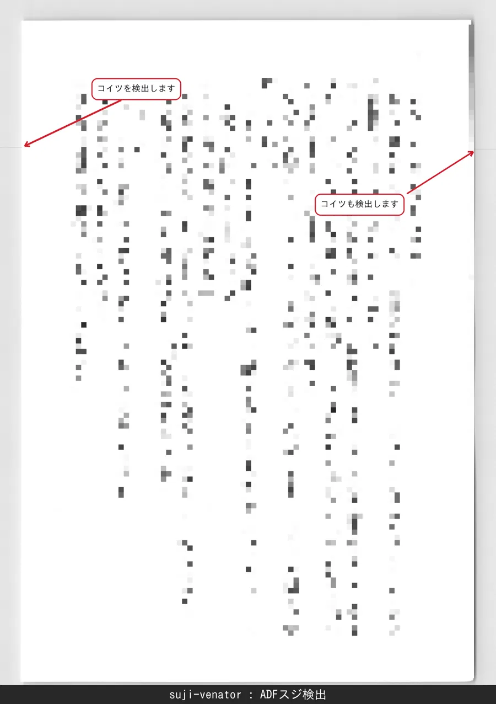

# suji-venator

**ADF 自炊スキャン画像の縦筋・横筋（スジ）を検出し、余白を自動除去するツール**
**Detects vertical/horizontal streaks in self-scanned images and auto-crops margins**
Claude Opus 4.7 が書きました。

---

## 概要 / Overview

**日本語**

`suji-venator`（スジ・ヴェナトール = スジ狩人）は、自炊（書籍の自己電子化）で生じるスキャン画像を後処理するツールです。主な目的は、ADF（自動給紙）スキャナのローラーやガラス面に付着したゴミ由来の**スジ（筋）を検出して警告する**ことです。あわせて、スキャナのガラス面背景に生じる余白を自動でクロップし、紙面の傾きを補正します。

**English**

`suji-venator` ("suji" = streak, Latin "venator" = hunter) is a post-processing tool for self-scanned book images. Its primary purpose is to **detect and flag streaks** caused by debris on the rollers or glass surface of ADF (Auto Document Feeder) scanners. It also automatically crops the scanner-background margins and corrects page skew.



---

## 特徴 / Features

- **スジ検出 / Streak detection**: 余白領域の輝度偏差から縦筋・横筋を検出し、該当ファイル名に `-line` を付加
- **余白除去 / Margin cropping**: 紙面端を検出してガラス面の余白を除去。ADF は端から内側へ走査し、フラットベッドは画像全体を領域分割して検出します
- **傾き補正 / Skew correction**: 検出した紙面端から傾きを推定し回転補正（フラットベッド向け）
- **検出失敗の通知 / Failure flagging**: 紙面端を検出できなかった場合は黙って画像端にフォールバックせず、`-edge` を付けて警告
- **異常検出 / Outlier detection**: 出力のアスペクト比・面積を統計的に集計し、外れ値に `-ratio` / `-size` を付加
- **並列処理 / Parallel processing**: 複数CPUコアでバッチ処理を高速化

---

## 対応スキャナ / Supported Scanners

| プロファイル / Profile | スキャナ / Scanner | 想定用途 / Use case |
|---|---|---|
| `crop-adf.py` | Epson DS-571W (ADF) | 書籍・漫画本文 / Book & manga pages |
| `crop-flatbed.py` | Epson GT-X830 (flatbed) | 画集・見開き / Art books & spreads |

いずれも**白背景スキャナ**（背景がほぼ白〜淡灰色）を前提としています。黒背景スキャナには未対応です。
Both assume **white-background scanners** (background is near-white to light gray). Black-background scanners are not supported.

---

## 動作要件 / Requirements

- ADF では、スキャン範囲を紙より 5mm ほど大きく設定してください（余白部分でスジを検出するため）。/
  For ADF scans, set the scan area about 5mm larger than the paper (streaks are detected in the margin region).
- 原稿はノド（綴じ側）を上にした横向きで ADF に給紙して、ドライバで回転させてください。これによりスジが横方向に出るため、左右の余白で検出できます。
  Feed pages sideways into the ADF with the gutter (binding edge) facing up, and set rotate in driver. This makes streaks run horizontally, so they can be detected in the left/right margins.
- Python 3.10 以上 / Python 3.10+
- 依存ライブラリ / Dependencies: `opencv-python`, `numpy`, `scipy`

```bash
pip install -r requirements.txt
```

---

## 使い方 / Usage

1. スクリプトと同じ階層に `crop/` フォルダを作成し、処理対象ファイル（1冊分）を入れます。
   Create a `crop/` folder next to the script and place your files (one book's worth) inside.

2. スキャナに応じてスクリプトを実行します。
   Run the script matching your scanner.

```bash
# ADF (DS-571W) の場合 / For ADF
python crop-adf.py

# フラットベッド (GT-X830) の場合 / For flatbed
python crop-flatbed.py
```

3. 処理済み画像が `output/` に PNG で出力され、処理結果が `crop_result.txt` に記録されます。
   Processed images are written to `output/` as PNG, and a summary is logged to `crop_result.txt`.

### フォルダ構成 / Folder structure

```
your-work-folder/
├── crop-adf.py
├── crop-flatbed.py
├── crop_core.py
├── crop/              # 入力 / Input (place files here)
│   ├── 001.png
│   └── 002.tif
├── output/            # 出力 / Output (auto-created, cleared each run)
│   ├── 001.png
│   └── 002.png
├── line-detected/     # スジ確認用の矢印付き画像 / Streak-annotated images (auto-created, cleared each run)
│   └── 002.png
└── crop_result.txt    # 処理ログ / Processing log
```

対応入力形式 / Supported input formats: `.png`, `.tif`, `.tiff`, `.bmp`
グレースケール・カラー・アルファ付き（BGRA）・16bit に対応します。検出は 8bit グレースケールに変換して行いますが、クロップは元画像に対して行うため、出力は入力の bit 深度とチャンネルを保持します。
Grayscale, color, alpha (BGRA) and 16-bit inputs are supported. Detection runs on an 8-bit grayscale copy, while cropping is applied to the original, so the output keeps the input's bit depth and channels.

出力は常に PNG / Output is always PNG.

> **注意 / Note**: `output/` は実行のたびに中身が削除されます。
> The `output/` folder is **cleared at the start of every run**.

---

## 出力ファイル名の規則 / Output Naming Convention

検出された問題に応じて、出力ファイル名に接尾辞が付きます。
Suffixes are appended to output filenames based on detected issues.

| 接尾辞 / Suffix | 意味 / Meaning |
|---|---|
| `-line` | スジを検出 / Streak detected |
| `-edge` | 紙面端の検出に失敗し画像端でフォールバック / Edge detection failed (fell back to image border) |
| `-ratio` | アスペクト比が外れ値 / Aspect ratio outlier |
| `-size` | 面積が外れ値 / Area (size) outlier |

例 / Example: `022.png` にスジがあれば `022-line.png` として出力されます。
複数該当する場合は連結されます（例: `088-ratio-size.png`）。
Multiple issues are concatenated (e.g., `088-ratio-size.png`).

---

## スクリプトの違い / Profile Differences

| 項目 / Item | `crop-adf.py` | `crop-flatbed.py` |
|---|---|---|
| 紙面検出 / Paper detection | 端から内側へ走査 / Scan inward from borders | 領域分割 / Whole-image segmentation*** |
| 傾き補正 / Skew correction | 無効 / Off* | 有効 / On |
| スジ検出 / Streak detection | 有効 / On | 無効 / Off** |
| 追加マージン / Extra margin | 8px | なし / None |
| 異常検出 / Outlier check | 有効 / On | 無効 / Off |

\* DS-571W のドライバ側「Correct Paper Skew」で補正済みを前提としています。
   Assumes skew is already corrected by the DS-571W driver's "Correct Paper Skew" option.

\*\* フラットベッドにはADF由来のスジが発生しないためです。
   Flatbed scans do not produce ADF-style streaks.

\*\*\* 端からの走査は紙面が画面の大半を占める前提のため、プラテン中央に置いた小さな原稿には届きません。フラットベッドでは画像全体を領域分割して紙面を探します（`region_detect`）。
   Scanning inward assumes the paper fills most of the frame, so it cannot reach a small document placed in the middle of the platen. The flatbed profile segments the whole image instead (`region_detect`).

---

## 既知の制約 / Known Limitations

- **コントラストの弱いスジ**は検出できない場合があります。スジの輝度が余白の背景色とほぼ同じ場合、原理的に検出が困難です。その場合は `streak_threshold` を下げることで検出感度を上げられます（ただし誤検出が増える可能性があります）。
  **Faint streaks** may go undetected. If a streak's brightness matches the margin background, detection is fundamentally difficult. In such cases, lowering `streak_threshold` increases sensitivity (at the cost of more false positives).

- **紙面コンテンツが端まで描かれている**漫画ページなどでは、紙面端の検出精度が落ちることがあります。その場合は `ScannerProfile` の各パラメータ（`shadow_range_high` や `ratio_sigma` など）を調整することで対応できます。
  Edge detection accuracy may degrade on pages where **content extends to the paper edge** (e.g., full-bleed manga). When this happens, you can compensate by tuning the `ScannerProfile` parameters (such as `shadow_range_high` or `ratio_sigma`).

- フラットベッドでは、原稿をプラテンの**外周（ビネットで暗くなる帯）から離して**置いてください。原稿が暗い外周に接していると、両者が一つの領域として繋がり検出に失敗することがあります。
  On the flatbed, place the document **away from the darker vignetted border** of the platen. If the document touches that border, the two can merge into one region and detection may fail.

- フラットベッドの領域検出（`region_detect`）は**1画像に原稿1枚**を前提とします。複数枚を並べて置いた場合、最も大きい1枚だけが切り出されます。また画面面積の 0.1% 未満の極小な原稿は検出対象外です。
  Flatbed region detection assumes **one document per image**. If several are placed side by side, only the largest is cropped. Documents smaller than 0.1% of the image area are not detected.

- スジ検出は**余白領域のみ**を対象とします。紙面内部（コンテンツ領域）を横切るスジは検出対象外です。しかしながら、原理的にそういったスジは余白部分にも現れるため、実用上は問題ないでしょう。
  Streak detection only examines **margin regions**; streaks crossing the content area are out of scope. In practice, however, such streaks also appear in the margins, so this is rarely an issue.

---

## パラメータ調整 / Tuning

各スクリプト冒頭の `ScannerProfile` で主要パラメータを調整できます。
Key parameters can be adjusted in the `ScannerProfile` at the top of each script.

| パラメータ / Parameter | 説明 / Description |
|---|---|
| `shadow_range_high` | 紙面判定の上側閾値。狭めると浅め、広げると深めにクロップ / Upper threshold for paper detection |
| `shadow_dip_threshold` | 影ディップ判定の深さ（右辺の影除去） / Shadow dip depth (right-edge shadow removal) |
| `streak_threshold` | スジ判定の輝度偏差。下げると敏感、上げると保守的 / Streak deviation threshold |
| `color_dist_threshold` | カラー入力時の紙面判定に使う彩度距離。色付き紙が背景と等輝度でも分離できる / Chroma-distance threshold for paper detection (color input) |
| `region_detect` | 端から走査せず画像全体を領域分割して紙面を検出。プラテン中央に置いた小さな原稿や、紙と背景の輝度差が小さい場合に有効（フラットベッドで既定 ON） / Detect the paper by segmenting the whole image instead of scanning inward from the borders (default ON for flatbed) |
| `adf_margin_px` | クロップ後の追加カット量 / Extra crop after edge detection |
| `ratio_sigma` | アス比・面積の外れ値判定の σ 倍数 / Sigma multiplier for outlier detection |

---

パラメータの調整に迷ったら、スクリプト・README.md・サンプル画像を LLM に渡して相談すると良いでしょう。
If you are unsure how to tune the parameters, try feeding the scripts, README.md, and sample images to an LLM and asking for advice.

## ライセンス / License

MIT License — see [LICENSE](LICENSE).
